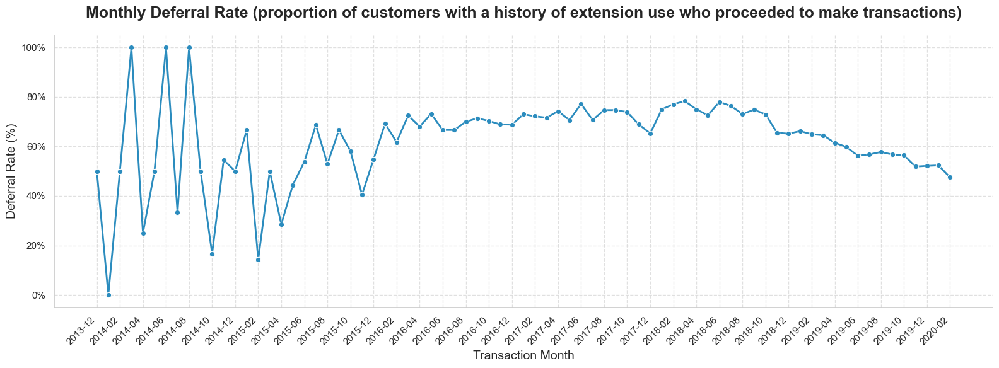

# Overview
Welcome to my analysis of a fintech company operating in the Czech Republic. This project focuses on [Twisto.cz](https://www.twisto.cz) and was created as part of a [case study](twisto_project/images/twisto_case_study.png) during an interview process.  

[The dataset](twisto_project/data_source) provided by the company includes information about new client registrations, customer demographics such as age, gender, and education, as well as details of transactions and the use of payment extensions. 

Using Python, I explored the data to better understand who Twisto’s customers are, how they behave when making purchases, and how often payments are deferred. The goal of this project is to present an accessible, data-driven overview of customer behavior and highlight insights that could support business and product decisions.

# The Questions
In this project, I aim to explore three main areas:

1. What is the socio-demographic profile of Twisto’s customers, and how does it change over time or by channel?
2. Do Apple and Android users differ in their purchasing behavior?
3. How do deferral rates develop over time, and do they vary across channels?

# Tools I Used
For this project, I worked with several tools that supported both analysis and presentation:

- **Python** – the main language for exploring the data  
  - **Pandas** for data analysis  
  - **NumPy** for numerical operations  
  - **Matplotlib** and **Seaborn** for visualizations  
  - **Streamlit** for creating simple interactive views  

- **Jupyter Notebooks** – to run code and document the analysis step by step  

- **Visual Studio Code** – for writing and testing Python scripts  

- **Git & GitHub** – for version control and sharing the project

# Data Preparation and Cleanup

In this section, I describe the steps taken to prepare the dataset for analysis, ensuring that it is accurate, clean, and ready for exploration.

## Import & Clean Up Data

First, I imported the necessary libraries and loaded the dataset, then extracted individual data frames for different aspects of the data.

```python
import pandas as pd
import streamlit as st

# Load an Excel file
excel_file = pd.read_excel('data_source/Twisto_data.xlsx', sheet_name=None)

# Extract individual DataFrames
df_base = excel_file['profile_base']
df_customer = excel_file['profile_customer']
df_extension = excel_file['profile_extension']
df_apps = excel_file['profile_apps']
df_transactions = excel_file['profile_transactions']

```
Next, I performed data cleaning tasks to ensure quality and consistency.

```python
# Correct specific incorrect dates
df_base['date_upgraded'] = df_base['date_upgraded'].replace({
    '2090-10-12 09:55:36.000': '2014-10-12 09:55:36.000',
    '2080-12-23 22:50:47.000': '2015-12-23 22:50:47.000'
})

# Convert to datetime
df_base['date_upgraded'] = pd.to_datetime(df_base['date_upgraded'], errors='coerce')

# Fill in all empty values in df_transaction (column: category)
df_transactions['category'] = df_transactions['category'].fillna('Unknown')

```
View my notebook with detailed steps here: [Data_cleaning_steps.ipynb](twisto_project/1_Data_cleaning_steps.ipynb).

# The Analysis

Each Jupyter Notebook in this project focuses on a specific aspect of the company's performance. Below is an overview of how I approached each question:

## 1. What is the socio-demographic profile of Twisto’s customers, and how does it change over time or by channel?

To answer this question, I analyzed the customer dataset to calculate total customers, the distribution of male and female customers, average age, education levels, and family size. I also created age bins and examined how the demographics of acquired customers, including gender, age, and education, evolved over time and across different acquisition channels.

View my notebook with detailed steps here: [Demographic_analysis.ipynb](twisto_project/2_Demographic_analysis.ipynb).

### Visualize Data

```python
# Group data
df_gender_time = df_cmr.groupby(
  [df_cmr['date_upgr'].dt.to_period("M"), 'gender'])['user'].count().unstack(fill_value=0
  )

# Plot setup
plt.figure(figsize=(20,10))
colors = ['#6baed6', '#fb6a6a', '#bdbdbd']  # blue, red, gray
df_gender_time.plot(kind='bar', stacked=True, width=0.75, color=colors)

plt.title("Gender Distribution Over Time", fontsize=14)
plt.xlabel("")
plt.ylabel("Number of Customers", fontsize=12)

# Show every 3d label with month names
N = 3
xticks = range(0, len(df_gender_time), N)
xticklabels = [x.strftime('%b %Y') for x in df_gender_time.index.to_timestamp()[::N]]
plt.xticks(ticks=xticks, labels=xticklabels, rotation=45, ha='right')

plt.legend(title='Gender', fontsize=11, title_fontsize=12)
sns.despine(top=True, right=True)
plt.tight_layout()
plt.show()
```

### Results


*Stacked bar chart showing how the composition of acquired users changed over time (October 2014 to Fabruary 2020).*

### Insights:

- **Young Adult Dominance:** The majority of Twisto’s customers are young adults, primarily aged 18-24 (36%), followed by 25-34 (32%). This trend is stable over time and is even more pronounced among Twisto cardholders (18-24 make up 35%), highlighting the importance of targeting products and marketing to this demographic.

- **Gender and Education Patterns:** Males slightly outnumber females, with the shift occurring from 2018 onward. Most customers have a high school education, are single, and do not have children. These characteristics suggest opportunities for marketing strategies that resonate with young, independent, and digitally savvy consumers.

- **Channel Effectiveness:** The most effective acquisition channels are “now” and “performance+organic,” performing consistently across genders, ages, and periods. Males are more likely than females to register via “ambassadors” or “referral” programs, indicating potential to optimize referral and ambassador campaigns for higher conversion among male users.


## 2. Do Apple and Android users differ in their purchasing behavior?

To ensure accurate calculations, I first created a dictionary categorizing users by iOS, Android, and Unknown platforms. This allowed me to filter the data correctly and compute key metrics such as total users, average transactions per user, and average spend. I also identified the top purchase categories and analyzed how user behavior varies across them.

View my notebook with detailed steps here: [OS_users_analysis.ipynb](twisto_project/3_OS_users_analysis.ipynb).

### Visualize Data
```python
# Combine into one DataFrame to create a table
summary_table = pd.DataFrame.from_dict({
    'iOS': ios_stats,
    'Android': android_stats,
    'Unknown': unknown_stats
}, orient='index')
```
### Results

  
*Table summarizes key purchasing metrics by platform.*

### Insights:

- **iOS Users – High Engagement, Frequent Buyers**: iOS customers demonstrate strong engagement with the platform, averaging ~140 transactions per user. They tend to have lower average order values but are highly valuable for retention-focused strategies, cross-selling, upselling, and loyalty programs.

- **Android Users – High-Value Transactions, Larger User Base**: Android dominates in overall revenue due to its larger user base and exhibits the highest average order value (~713). These users are ideal targets for premium bundles, big-ticket promotions, and bulk purchase incentives.

- **Unknown OS Segment – Investigative Opportunity**: Users with unidentified operating systems show mid-tier spending patterns. This segment warrants further investigation to clarify data quality issues or capture untracked platforms, potentially unlocking additional growth opportunities.


## 3. How do deferral rates develop over time, and do they vary across channels?

Twisto offers a feature that allows customers to postpone their bill to a later due date (referred to as an extension). The deferral rate is defined as the share of customers who have used the extension at least once (used_extension=TRUE) relative to the total customer base.

In this method, I calculated the number of newly acquired users in each quarter and measured what percentage of them ever used the extension at least once. While this method is simple, it has a limitation: it does not account for when customers actually used the extension. For example, a customer acquired in Q1 may only use the extension much later, which makes this metric less informative for understanding short-term adoption dynamics.

```python
deferral_by_quarter = (
    df_ext_merged.groupby('acq_quarter')
    .agg(
        total_users=('user', 'nunique'),
        users_with_extension=('used_extension', lambda x: (x == True).sum())
    )
)

deferral_by_quarter['deferral_rate'] = deferral_by_quarter['users_with_extension'] / deferral_by_quarter['total_users']
deferral_by_quarter.reset_index(inplace=True)
```
  
*Line chart showing deferral rate trends based on new customer cohorts.*

The second approach looks at customers who actively transacted in a given month and measures what share of them had ever used the extension. This view better reflects actual usage patterns because it focuses on active customers within each period rather than acquisition history alone.

```python
monthly_deferral['deferral_rate'] = (
    monthly_deferral['users_with_extension'] / monthly_deferral['total_users']
)
```
View my notebook with detailed steps here: [Deferral_rate_analysis](twisto_project/4_Deferral_rate_analysis.ipynb).

#### Visualize Data 

```python
plt.figure(figsize=(16,6))
sns.lineplot(
    data=monthly_deferral,
    x=monthly_deferral['trans_month'].astype(str),
    y='deferral_rate',
    marker='o',
    linewidth=2,
    markersize=6,
    color='#2b8cbe'
)
plt.tight_layout()
plt.show()
```
#### Results

  
*Line chart showing monthly deferral rate trends among transacting customers*

#### Insights
- In the first months, the deferral rate peaked at 100%. These values are misleading, as they were based on very few customers (small denominator). As the customer base grew, adoption became less universal; on average, about 1 in 4 customers with an extension history continued to make transactions.

- The stabilization at 70% indicates that, over a long period, the vast majority of transacting users were also extension users, which is a strong signal of feature stickiness.

- Customers acquired through performance and organic campaigns show the highest long-term deferral rates. This suggests that these channels attract users with a stronger affinity for Twisto’s postponement product compared to referrals or ambassador-driven signups.

# What I Learned

Throughout this project, I strengthened my analytical and technical skills while gaining practical experience in interpreting and communicating data insights. Here are a few specific things I learned:

- I learned to look beyond raw trends, recognizing that early months with a small customer base can distort results. This helped me identify which patterns were statistically meaningful and which were not.

- I improved my ability to translate numbers into clear narratives, supporting insights with concrete data. Comparing acquisition channels taught me how user behavior relates to marketing sources, uncovering long-term trends and feature engagement.

- I enhanced my Python skills, using Pandas for data manipulation and Seaborn and Matplotlib for visualization, which allowed me to perform complex analyses more efficiently.

# Challenges I Faced

This project presented several challenges that became valuable learning experiences:

- **Data Inconsistencies**: Managing missing or inconsistent data required careful cleaning and validation to ensure the accuracy and reliability of the analysis.

- **Complex Data Visualization**: Creating clear and effective visualizations from complex datasets was challenging but essential for conveying insights meaningfully.

- **Balancing Breadth and Depth**: Finding the right balance between exploring data in detail and maintaining a comprehensive overview required constant judgment to avoid getting lost in the minutiae while still uncovering key insights.

# Conclusion

This analysis of Twisto’s customers and the payment extension feature has been highly informative, highlighting key patterns in user behavior and channel performance. I learned a lot about user behavior, differences between iOS and Android users, and which channels drive the most engaged customers. The project reinforced the value of careful data preparation and analysis, and showed how turning complex data into clear insights can help guide business and product decisions.